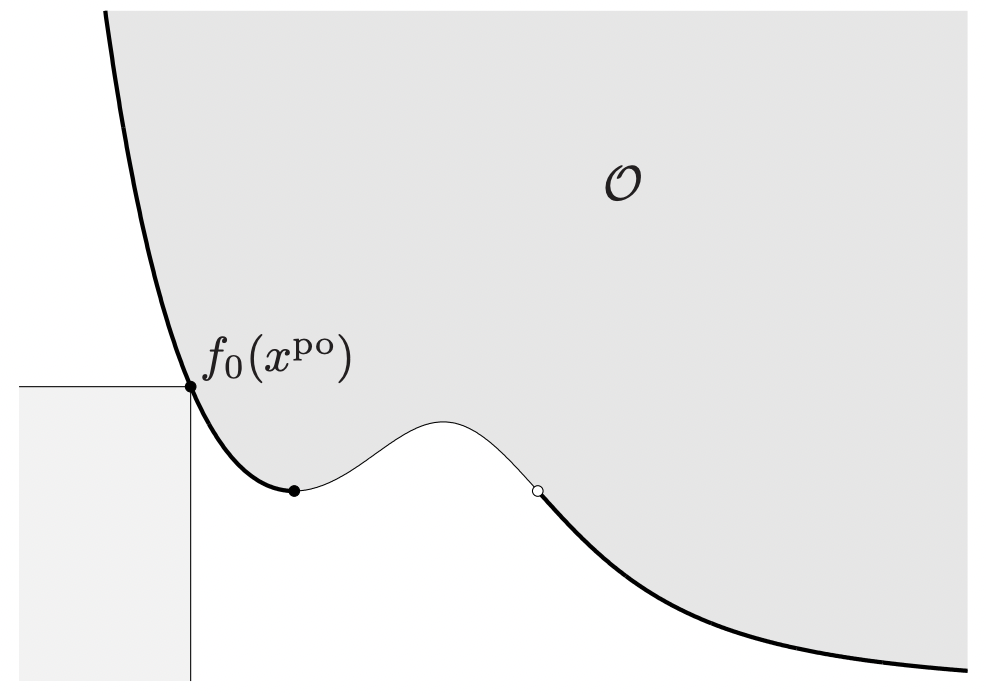

# Trade-offs

Often, an interviewer expects you to discuss a trade-off between two desirable properties. While there can be more than two, this is a less common setting in which many of these ideas can easily be adapted.

**What they are looking for:** The ability to recognize a that instead of a single solution, there is a space of feasible solutions, as well as ideas on how to navigate this space.

## Generalities

One structured approach for discussing a trade-off is answering the following questions.
1. **What are the controllable hyperparameters that allow you to navigate this tradeoff?** Usually, there is a single dial (e.g. the classification threshold for the precision-recall trade-off) that is tuned to achieve a particular balance between the properties of interest. It is essential to identify what exact setting can be changed in order to mechanistically control the two properties. Needless to say, be sure which direction affects the metrics in which way (up or down).
2. **What are the evaluation metrics that allow you to select these hyperparameters?** After identifying the knobs to turn, select ways to evaluate your options. One method is to choose a single-number summary that depends on the values of both properties. Another is to require only that a given solution is *Pareto optimal*, in that any change that make one property more favorable will make the other less favorable. Such a solution is also said to be on the *Pareto frontier* of solutions. In the figure below, $f_0: \mathcal{X} \rightarrow \mathbb{R}^2$ is an objective function to be minimized, $\mathcal{O}$ is the set of achievable values of $f_0$, and $x^{\text{po}}$ is a Pareto optimal point. Among points on the frontier, a traditional ML evaluation metric or a domain-specific metric (number of movies watched, number of lives saved, etc) can select a solution. One might ask: why bother with the original trade-off at all if ultimately we will pick the best solution in accordance with a single metric? The answer is that 1) the Pareto frontier provides a constrained search space of solutions, specifically one in which no solution is dominated by another in terms of the original two properties, and 2) this optimization is usually much simpler to execute (likely in one dimension).

 

**Source:** [Convex Optimization – Boyd and Vandenberghe](https://web.stanford.edu/~boyd/cvxbook/)

## Examples

- **Bias-Variance:** The control for this setting is *model complexity*, which will vary depending on context. In a traditional regression setting, it will be the regularization constant or the dimensionality of the feature representation. In neural networks, this could include architecture choice (number of layers/units), dropout probability, early stopping, and data augmentation. A natural single-number summary for this trade-off is *mean squared error*. In more traditional settings, it can be relevant to also connect this trade-off to ensemble methods. Specifically, if we have access to many high-variance, low-bias learners, *bagging* can reduce the variance. Similarly, if we have access to many high-bias, low-variance learners, *boosting* can combine the biases in a useful way.
- **Precision-Recall (PR):** In binary classification, the PR-curve is formed using all values of the *classification threshold*. One way to choose this is *precision-at-recall-0.9*, which is simply fixing the recall to be above 90% (or any number) and picking the threshold which maximizes precision. Note that the question of picking the threshold is different from picking between various methods by summarizing the entire PR trode-off (such as by *F1-score* or *AUC*).
- **Computational-Statistical:** An example in which this trade-off appears is *dimension reduction*. By the *data-processing inequality*, reducing dimension can only destroy information, i.e. hampering statistical performance in the interest of computational tractability. The hyperparameter is the *dimension* of the reduced representation. Another example is in *Markov Chain Monte Carlo (MCMC)* estimation, in which sampling more iterates can increase statistical performance but spend more computational resources. In most cases, evaluation can be done my maximum statistical performance (validation accuracy, say) given a fixed computational budget (wall time, money spent, energy consumed, etc).
- **Accuracy-Fairness:** Considering there are many definitions of algorithmic fairness, the tunable hyperparameter and evaluation metrics would vary widely for this trade-off. Nonetheless, it is always good to mention, especially if you use a particular technical definition of fairness (*equalized odds*, *demographic parity*, etc).
- **Forest-Network:** This one is really many trade-offs combined into one. Decision forest methods (random forest, gradient-boosted decision trees (GBDTs)) are very popular in practice, and it is relevant to compare them to neural networks (NNs). 
    - There is a belief that GBDTs "just work", in that they can be spun up with little effort and virtually *no hyperparameter tuning*, as opposed to the many possible hyperparameters that might come up for a neural net (learning rate, implicit regularization, architecture).
    - When using random forests, another benefit is that many trees can be trained *in parallel*, potentially making it a much faster method than NNs if given access to a wide CPU cluster.
    - NNs are undisputed when working with *structured data* such as images and text. That being said, it is common practice to use pre-trained networks (often called *encoders* in this context) to represent images/text/audio as unstructured, frozen vectors and then apply GBDTs to the resulting representations. However, if one wants to update the encoders via backpropagation, it is much easier to use a small linear/logistic regression or NN *head* on top of the pretrained network.
    - There is also a belief that forest-based methods are more *interpretable*, in that they come with a natural measure of [feature importance](https://scikit-learn.org/stable/auto_examples/ensemble/plot_forest_importances.html). Be mindful of the criticisms of this and other feature importance measures.
